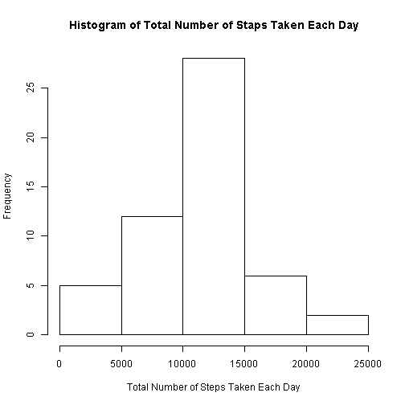
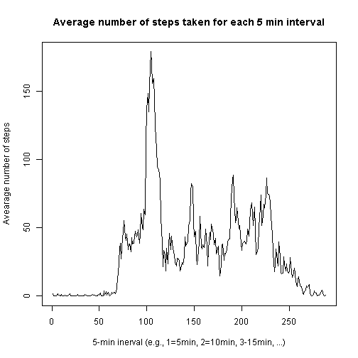
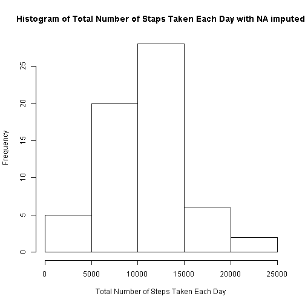
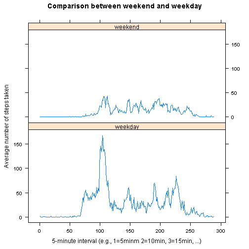

```r
library(knitr)
opts_chunk$set(echo = TRUE)
```

## Loading and preprocessing the data


```r
dataset <- read.csv("activity.csv")
```

## What is mean total number of steps taken per day?

1. Calculate the total number of steps taken per day. 


```r
total_steps_day <- aggregate(steps ~ date, data = dataset, FUN = sum, na.action = na.omit)
```

2. Make a histogram. The frequency indicates a number of days.


```r
hist(total_steps_day$steps, xlab = "Total Number of Steps Taken Each Day", main = paste("Histogram of", "Total Number of Staps Taken Each Day"))
```

 

3. Calculate and report the mean of the total number of steps taken per day.


```r
# Mean of the total steps per day.
mean(total_steps_day$steps)
```

```
## [1] 10766.19
```

3. Calculate and report the median of the total number of steps taken per day.


```r
# Median of hte total steps per day.
median(total_steps_day$steps)
```

```
## [1] 10765
```

## What is the average daily activity pattern?

1. Make a time series plot (i.e. type = "l") of the 5-minute interval (x-axis) and the average number of steps taken, averaged across all days (y-axis)


```r
# First calcualte the total steps per interval
average_steps_interval <- aggregate(steps ~ interval, data = dataset, FUN = sum, na.action = na.omit)
# Then calcuate the average number of steps by divising them by the number of each interval, which is 61
average_steps_interval$steps <- average_steps_interval$steps/61
# Add a sequence of numbers from 1 to 288 as interval_sequene
average_steps_interval$sequence <- 1:288
# Make a time series plot (i.e. type = "l") 
plot(average_steps_interval$sequence, average_steps_interval$steps, type = "l", xlab = "5-min inerval (e.g., 1=5min, 2=10min, 3-15min, ...)", ylab = "Avearage number of steps", main = "Average number of steps taken for each 5 min interval")
```

 

2. Which 5-minute interval, on average across all the days in the dataset, contains the maximum number of steps?


```r
index <- which.max(average_steps_interval$steps)
average_steps_interval[index, c("interval","steps")]
```

```
##     interval    steps
## 104      835 179.1311
```

The 5 minutes interval between 8:35 a.m. and 8:40 a.m. contains the maximum number of average steps. The strategy is to use the mean for that interval.

## Imputing missing values

1. Calculate and report the total number of missing values in the dataset (i.e. the total number of rows with NAs)


```r
total <- is.na(dataset$steps)
sum(total)
```

```
## [1] 2304
```

2. Devise a strategy for filling in all of the missing values in the dataset. The strategy is to use the average steps per interval.


```r
# merge the original dataset and average_steps_inteval 
merged_dataset <- merge(dataset, average_steps_interval, by.x = "interval", by.y = "interval")
```

3. Create a new dataset that is equal to the original dataset but with the missing data filled in.


```r
# substitunte NAs by the average values of the correponding interval
nas <- is.na(merged_dataset$steps.x)
merged_dataset[nas, "steps.x"] <- merged_dataset[nas, "steps.y"]
```

4. Make a histogram of the total number of steps taken each day and Calculate and report the mean and median total number of steps taken per day. 


```r
total_steps_day_imputed <- aggregate(steps.x ~ date, data = merged_dataset, FUN = sum, na.action = na.omit)
# Plot a histgram 
hist(total_steps_day_imputed$steps.x, xlab = "Total Number of Steps Taken Each Day", main = paste("Histogram of", "Total Number of Staps Taken Each Day with NA imputed"))    
```

 

Mean of the total number of steps per day.


```r
mean(total_steps_day_imputed$steps.x)
```

```
## [1] 10581.01
```
                                     
Medain of the total number of steps per day.


```r
median(total_steps_day_imputed$steps.x)
```

```
## [1] 10395
```

**Do these values differ from the estimates from the first part of the assignment?** 

Yes, total number of steps taken between 5000 and 10000 steps increased from about 12 daYS to 20 days. However the pattern and the rest seem to stay unchanged. 

**What is the impact of imputing missing data on the estimates of the total daily number of steps?**

This seemd to provide more accurate estimates of the total daily number of steps, however this will depends on the strategy to impute the data.

## Are there differences in activity patterns between weekdays and weekends?

1. Create a new factor variable in the dataset with two levels - "weekday" and "weekend" indicating whether a given date is a weekday or weekend day.


```r
# copy the dataset imputed wihout NA
dataset2 <- merged_dataset
# convert the date to the week of the day
dataset2$week <- weekdays(as.Date(dataset2$date, "%m/%d/%Y"))
# convert the week of the day to weekday or weekend
dataset2$week[dataset2$week %in% c("Monday", "Tuesday", "Wednesday", "Thursday", "Friday")] <- "weekday"
dataset2$week[dataset2$week %in% c("Saturday", "Sunday")] <- "weekend"
# make the new variable as a factor variable
dataset2$week <- as.factor(dataset2$week)
```

2. Make a panel plot containing a time series plot (i.e. type = "l") of the 5-minute interval (x-axis) and the average number of steps taken, averaged across all weekday days or weekend days (y-axis). 


```r
library(lattice)
# Calculate average steps for each interval in the weekday
data_weekday <- subset(dataset2, week == "weekday")
average1 <- aggregate(steps.x ~ interval, data = data_weekday, FUN = sum)
average1$steps.x <- average1$steps.x/61
average1$seq <- 1:288
average1$week <- "weekday"
# Calculate average steps for each interval in the weekend
data_weekend <- subset(dataset2, week == "weekend")
average2 <- aggregate(steps.x ~ interval, data = data_weekend, FUN = sum)
average2$steps.x <- average2$steps.x/61
average2$seq <- 1:288
average2$week <- "weekend"
# Combine the weekday and weekend data
average <- rbind(average1, average2)
average$week <- as.factor(average$week)
# Make a time series panel plot for weekend and weekday
xyplot(steps.x ~ seq | week, data = average, type = "l", layout = c(1,2),xlab = "5-minute interval (e.g., 1=5minm 2=10min, 3=15min, ...)", ylab = "Average number of steps taken" , main = "Comparison between weekend and weekday")
```

 


